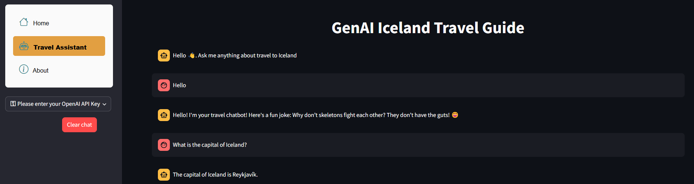

# AI Travel Chatbot – RAG & LLM ✈️



## Overview

This project is an AI-powered chatbot that provides real-time travel advice about Iceland. It utilizes **Retrieval-Augmented Generation (RAG)** by storing document embeddings in **ChromaDB** and retrieving relevant information to generate responses using a **Large Language Model (LLM)**.

## Features

- **ChromaDB for Embeddings**: Stores and retrieves document embeddings  (OpenAI's `text-embedding-3-large`) for relevant travel insights.
- **Streamlit**: Provides a user-friendly interface for travelers to ask questions.
- **AI-Powered Responses**: Uses an LLM ([OpenAI's](https://platform.openai.com/api-keys) `gpt-4o`) to generate accurate and meaningful travel answers.
- **Performance Evaluation**: Responses were tested using an LLM as a judge, with a **9/10** accuracy rating being the most common score.

## Data Sources

The data used for this project includes:

- **Travel Guides**: Publicly available travel guides about Iceland.
- **Tourism Websites**: Information from Icelandic tourism websites.
- **MG Trip PLanner**: Iceland on a budget information.
- **Custom Data**: Curated datasets collected via paid APIs (not included in the repository due to privacy concerns).

The data was preprocessed and cleaned using the `data_cleaning.ipynb` notebook, and document chunks were created using the `chunks.ipynb` notebook. These notebooks are included for reference but can not be run, since they need the curated dataset collected via paid APIs.

## Project Structure

Below is the project structure with a brief explanation of each component:

```bash
genai-travel-guide/
├── app/
│   ├── images/                            # Static assets like images or icons for the app
│   ├── _pages/                            # Directory containing the main page components of the app
│   │   ├── about.py                       # About page of the app
│   │   ├── chat.py                        # Chat interface for user interactions
│   │   └── home.py                        # Home page of the app
│   └── app.py                             # Main Streamlit app for user interaction
├── chroma_db/
│   ├── chromas.sqlite3                    # SQLite database for storing document embeddings
│   └── query_embeddings_cache.pkl         # Cache file for query embeddings
├── genai_scripts/
│   ├── fonts/                             # Folder for storing custom font files used in visualizations
│   │   └── Montserrat-Regular.ttf         # Custom font Montserrat-Regular
│   ├── __init__.py                        # Initialization file for the custom module
│   ├── data_check.py                      # Script for checking data integrity
│   ├── data_cleaning.py                   # Script for cleaning and preprocessing data
│   ├── data_storage.py                    # Script for creating chunks, embeddings and storing data in ChromaDB
│   ├── eda.py                             # Script for exploratory data analysis in the chunks
│   └── GenAI_RAG.py                       # Script for generating responses using RAG approach and LLM
├── images/                                # Folder for storing visual assets
├── notebooks/
│   ├── chunks.ipynb                       # Notebook for creating document chunks and saving chunk embeddings in ChromaDB
│   ├── data_cleaning.ipynb                # Notebook for cleaning and preprocessing data
│   └── GenAI_RAG.ipynb                    # Notebook for testing the RAG system
├── reports/                         
│   └── Iceland_travel_AI_assistant.pdf    # Final project report
├── .gitignore                             # Specifies files/folders for Git to ignore (e.g., temporary files, credentials)
├── LICENSE                                # License file for the project
├── pyproject.toml                         # Configuration file for project setup
├── README.md                              # Project documentation
├── requirements.txt                       # List of Python dependencies
├── setup.py                               # Setup script for installing the project
└── update_vscode.py                       # Script for updating VSCode settings
```

## Installation & Setup

### 1. Clone the Repository

```bash
git clone https://github.com/annnieglez/genai-travel-guide
cd genai-travel-guide
```

### 2. Create a Virtual Environment (Optional but Recommended)

```bash
python -m venv rag_chat
source rag_chat/bin/activate        # On macOS/Linux
source rag_chat\Scripts\activate    # On Windows
```

### 3. Update VSCode Settings (Optional)

Run the following script to configure VSCode for the project:

```bash
python update_vscode.py
```

### 4. Install the Project in Editable Mode

From the main directory, run:

```bash
pip install -e .
```

to install the custom scripts.

### 5. Install Dependencies

```bash
pip install -r requirements.txt
```

### 6. Configure your OpenAI API Key

Create a `.env` file in the main directory and add your OpenAI API key:

```bash
echo OPENAI_API_KEY="your_openai_api_key" > .env
```

Replace `your_openai_api_key` with your actual API key.

### 7. Run the Streamlit App

Navigate to the `app` folder and run:

```bash
streamlit run app.py
```

Ensure you are inside the `app` folder for correct retrieval of the ChromaDB database.

Alternatively, you can run the retrieval system directly from the `GENAI_RAG.ipynb` notebook for testing and experimentation, or you can access the deployed app directly at [Iceland Travel AI Assistant](https://genai-chatbot-rag-travel-iceland.streamlit.app).

## Conclusion

This AI assistant has demonstrated high accuracy and effectiveness, offering meaningful insights for travelers. The RAG system ensures responses are well-informed, and testing with an LLM judge confirms a **9/10 accuracy score** in most cases.

## Future Improvements

- Expand the knowledge base with more travel datasets.
- Improve response personalization based on user preferences.
- Implement voice-based interaction for hands-free queries.

## Contributing

Pull requests are welcome! If you'd like to contribute, please fork the repository and create a new branch for your changes.

## License

This project is licensed under the [MIT License](https://opensource.org/licenses/MIT). See the `LICENSE` file for details.

## Author

This project was created by Annie Meneses Gonzalez. Feel free to connect with me on [LinkedIn](https://www.linkedin.com/in/annie-meneses-gonzalez-57bb9b145/).

---

💙 *Happy travels with AI-powered insights!*
